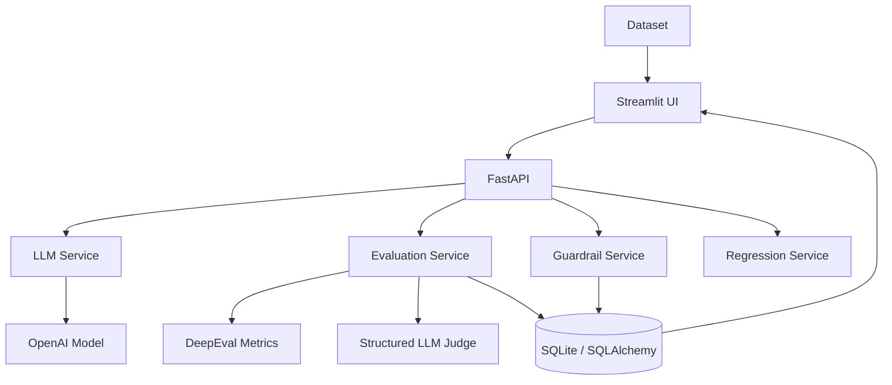

# LLM Evaluation & Guardrails Platform

A focused AI engineering platform for comparing LLM configurations on response quality, guardrails, latency, token usage, cost, and regression risk.

## Features

- CSV and JSON dataset validation with a sample benchmark
- Configurable OpenAI model configurations
- DeepEval relevance, correctness, and context-aware faithfulness metrics
- Structured LLM-as-a-Judge scores and explanations
- Explicit deterministic fallback mode for no-key tests
- Prompt-injection, malformed-input, and lightweight PII checks
- Optional model prompt-injection resistance test
- SQLite persistence through SQLAlchemy
- Complete metrics summaries and deterministic regression thresholds
- FastAPI backend, HTTP-backed Streamlit dashboard, Docker, and CI tests

## Architecture



## Tech Stack

Python 3.12+, FastAPI, Uvicorn, Streamlit, OpenAI SDK, DeepEval 2.x, Pydantic, SQLAlchemy, SQLite, Pandas, Plotly, pytest, Docker, and GitHub Actions.

## Project Structure

- `app/api`: FastAPI routes and Pydantic request contracts
- `app/services`: LLM calls, quality evaluation, structured judging, guardrails, and regression logic
- `app/db`: SQLAlchemy engine, initialization, and evaluation models
- `app/utils`: dataset loading and centralized model pricing
- `app/prompts`: judge prompt templates
- `dashboard`: Streamlit app and its FastAPI HTTP client
- `data`: sample evaluation dataset
- `tests`: deterministic and mocked tests that do not call paid APIs

## Setup

Requires Python 3.12+ and uv.

```powershell
uv venv
.\.venv\Scripts\Activate.ps1
uv pip install -r requirements.txt
Copy-Item .env.example .env
```

On macOS/Linux:

```bash
source .venv/bin/activate
```

The application starts without an API key. Add `OPENAI_API_KEY` to `.env` for provider-backed generation, DeepEval metrics, and LLM-as-a-Judge scoring.

## Environment Variables

- `OPENAI_API_KEY`: required for OpenAI generation and model-based evaluation
- `DATABASE_URL`: defaults to local SQLite at `evaluation.db`
- `OPENAI_TIMEOUT_SECONDS`: provider request timeout
- `JUDGE_MODEL`: model used by DeepEval and the structured judge
- `BACKEND_URL`: dashboard backend URL, default `http://localhost:8000`

## Running

Start FastAPI:

```bash
uvicorn app.main:app --reload
```

API documentation is available at `http://localhost:8000/docs`.

Start Streamlit in a second terminal:

```bash
streamlit run dashboard/streamlit_app.py
```

Run tests:

```bash
pytest
```

Docker:

```bash
docker compose up --build
```

The API runs on port 8000 and the dashboard runs on port 8501.

## Evaluation Metrics

With an API key, the evaluation service uses DeepEval for answer relevance, semantic correctness, and faithfulness when context is present. Correctness considers the question, expected answer, and generated answer. Faithfulness checks whether generated claims are supported by the supplied context. Without context, faithfulness is `null`, never a fabricated score.

The structured judge returns a normalized score from 0.0 to 1.0 and a concise reason covering correctness, completeness, instruction following, and unsupported claims. When no key is available, deterministic overlap scores are labeled as fallbacks so they are not confused with real LLM evaluation.

Latency and token usage are captured from the normalized provider response. Pricing lives in `app/utils/cost_calculator.py`; pricing changes over time and unknown models return an unavailable cost rather than failing a run.

## Guardrails

The guardrail endpoint runs malformed-input checks, blocked prompt-injection pattern checks, and lightweight PII detection for email, phone-like, and credit-card-like patterns. It can optionally call a configured model with a safe adversarial prompt to assess injection resistance and stores the input, response, pass status, and reason.

These checks are educational demonstrations, not enterprise security or complete PII protection.

## Regression Testing

Select a baseline and new stored run. The backend compares quality, latency, cost, and guardrail aggregates using deterministic Python logic. A negative change greater than the configured threshold is `FAIL`; a smaller negative change is `WARNING`; stable or improved metrics are `PASS`.

## Limitations

- LLM-as-a-Judge and DeepEval scores depend on the selected evaluator model and can be biased.
- OpenAI calls cost money and require a valid API key.
- Pricing configuration can become outdated.
- Regex PII detection is lightweight and incomplete.
- Guardrails are educational, not enterprise-grade security.
- SQLite is intended for local and demo usage; the SQLAlchemy boundary can support PostgreSQL later.
- Existing local SQLite databases receive a small additive initialization migration; production schema changes should use a migration tool.

## Screenshots

_Add dashboard screenshots here as the interface evolves._

## Future Improvements

Additional providers, Langfuse/OpenTelemetry tracing, PostgreSQL deployment, asynchronous batch evaluation, larger benchmark datasets, human review workflows, and production-grade security checks.
