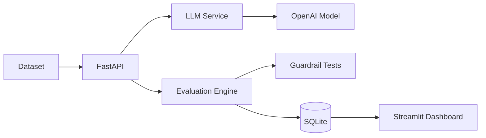

# LLM Evaluation & Guardrails Platform

A practical evaluation workbench for comparing LLM configurations on quality, safety signals, latency, token usage, cost, and regression performance.

## Features

- CSV and JSON evaluation datasets
- Configurable OpenAI model configurations
- Correctness, relevance, and context-aware faithfulness signals
- LLM-as-a-judge extension point with structured result fields
- Lightweight prompt-injection, malformed-input, and PII checks
- SQLite persistence through SQLAlchemy
- Regression thresholds with PASS, WARNING, and FAIL statuses
- FastAPI backend and Streamlit dashboard
- Docker Compose and GitHub Actions tests

## Architecture



## Project Structure

- `app/api`: FastAPI routes and Pydantic contracts
- `app/services`: LLM calls, evaluation, guardrails, and regression logic
- `app/db`: SQLAlchemy engine and models
- `app/utils`: dataset loading and centralized pricing
- `dashboard`: Streamlit user interface
- `tests`: no-cost deterministic tests
- `data`: sample benchmark dataset

## Setup

Requires Python 3.12+ and uv.

```powershell
uv venv
.\.venv\Scripts\Activate.ps1
uv pip install -r requirements.txt
Copy-Item .env.example .env
```

On macOS/Linux:

```bash
source .venv/bin/activate
```

Set `OPENAI_API_KEY` in `.env` to run provider-backed evaluations. The application starts without it, and returns a clear error only when an LLM call is attempted.

## Running

Backend:

```bash
uvicorn app.main:app --reload
```

OpenAPI docs are available at `http://localhost:8000/docs`.

Dashboard:

```bash
streamlit run dashboard/streamlit_app.py
```

Tests:

```bash
pytest
```

Docker:

```bash
docker compose up --build
```

The API runs on port 8000 and the dashboard on port 8501.

## Metrics

Correctness compares expected-answer terms with generated-answer terms. Relevance checks overlap with the question. Faithfulness is only calculated when a dataset row supplies context. Latency, usage, and estimated cost come from the normalized provider response. Pricing is centralized and should be updated as provider prices change; unknown models return an unavailable cost.

The database includes judge score and reasoning fields. The default local evaluator uses an explainable deterministic baseline so tests remain free and repeatable; a production deployment can connect the judge service to a selected judge model.

## Guardrails

The educational guardrail suite checks prompt-injection phrases, blank or oversized input, and obvious email, phone, and credit-card-like patterns. These are lightweight demonstrations, not production-grade security or PII protection.

## Regression Testing

Choose a baseline and new run, then compare aggregate metrics. A decline larger than the configured threshold is `FAIL`; a smaller decline is `WARNING`; stable or improved metrics are `PASS`.

## Screenshots

_Add dashboard screenshots here as the interface evolves._

## Future Improvements

- Additional model providers
- Langfuse or OpenTelemetry tracing
- PostgreSQL deployment
- Asynchronous batch evaluation
- Larger benchmark datasets and human review
- Production-grade security and PII detection
